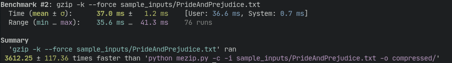

# meZip
My hobby implementation of the LZ78 compression algorithm in Python. This is not intended to be a practical utility (see [performance](#performance)), but rather just something I did for fun/to better understand LZ78.

## Requirements
- Python 3
- Bitarray:

  `python -m pip install -r requirements.txt`

## Usage
To compress a file:

`python mezip.py -c -i input_dir/input_file.txt -o output_dir/`

To decompress a file:

`python mezip.py -i input_dir/input_file.mz -o output_dir/`

## Performance
I used hyperfine to run a very simple benchmark comparing my compression utility to gzip on compressing Pride and Prejudice. This is somewhat of an apples to oranges comparison, but at least gives a rough estimate of how my compression utility performs.

From this benchmark, we can see that meZip is incredibly slow, at about 3000 times slower than gzip on this particular task. Part of this can be attributed to the fact that meZip is written in python, but there are also some glaring inefficiencies in how I wrote it. For example, the fact that compression iterates over the contents of the file being compressed twice.

On the front of compression ratio, however, meZip fares a little better. Uncompressed, Pride and Prejudice takes up about 709 KB on disk. With default options, gzip compresses that down to 254 KB, a compression ratio of 35%. MeZip doesn't get quite that small, but still does pretty well at 317 KB, yielding a ratio of 44%, or just under 10% bigger than gzip. If mezip were at all optimized (it isn't), at least I could claim it was optimized for compression size.

## References
This implementation is mostly based on some notes/an example by Peter Shor (of quantum factoring algorithm fame) from when he was teaching a Principles of Discrete Applied Mathematics course at MIT, available [here](http://www-math.mit.edu/~shor/PAM/lempel_ziv_notes.pdf). Of the sample inputs, Grimm's Fairy Tales, Metamorphosis, and Pride and Prejudice were all obtained from [Project Gutenberg](https://www.gutenberg.org/).
